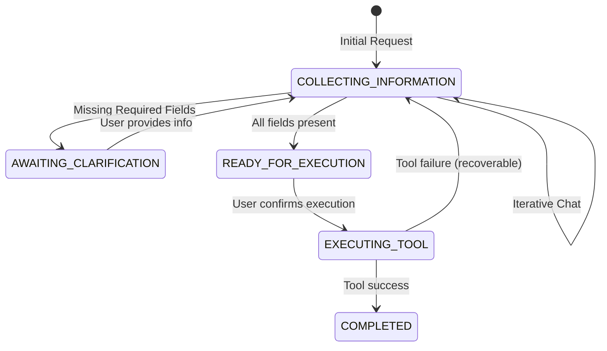

# Conversation API

The AI-First Conversation API provides a unified interface for the frontend React application to interact with the backend CRM workflow. It is designed so that every chat interaction automatically returns both the conversational response and the latest structured CRM state.

## Response Lifecycle

1. **User sends a message** to `/api/v1/chat/`.
2. **Backend processes the message** using the LangGraph workflow, maintaining conversation context, parsing intents, updating the draft, and potentially executing tools.
3. **Backend maps the final state** into a unified `ConversationResponse` contract.
4. **Frontend renders the response**, natively showing AI text and immediately syncing the structured `interaction_draft` to a visual panel.

## API Schema

**Endpoint**: `POST /api/v1/chat/`

### Request Payload

```json
{
  "user_message": "Log call with Dr. Smith.",
  "conversation_id": "optional-uuid",
  "message_history": []
}
```

### Response Payload (`ConversationResponse`)

The response guarantees a stable contract; absent sections are simply `null` or empty rather than omitted.

```json
{
  "success": true,
  "message": "Chat processed successfully",
  "data": {
    "assistant_message": "I've started a draft for Dr. Smith.",
    "conversation_id": "c1f8a-...",
    "conversation_status": "COLLECTING_INFORMATION",
    "draft_status": "PARTIAL",
    "interaction_draft": {
      "hcp_name": "Dr. Smith"
    },
    "draft_changes": [
      {
        "field_name": "hcp_name",
        "previous_value": null,
        "current_value": "Dr. Smith",
        "change_type": "updated"
      }
    ],
    "clarification_state": null,
    "decision_output": {
      "action": "RESPOND",
      "tool_readiness": "NOT_READY",
      "decision_confidence": 0.9,
      "next_state": "COLLECTING_INFORMATION"
    },
    "tool_execution_result": null,
    "conversation_metadata": {
      "message_count": 1
    }
  }
}
```

## Synchronization Flow

The core principle of this API is **Draft Synchronization**.
- You do not need to fetch the draft separately.
- Every chat request returns the `interaction_draft` object reflecting the latest immutable updates made by the AI.
- `draft_changes` specifies exactly which fields were added, updated, or removed, allowing the frontend to highlight these fields visually to the user.

## Clarification Workflow

When the AI needs missing information to proceed, the response gracefully exposes this state:
- `conversation_status` transitions to `AWAITING_CLARIFICATION`.
- `clarification_state` becomes populated, containing `missing_fields`, `required_fields`, and `clarification_reason`.

The frontend should interpret this state and visually indicate to the user what information needs to be provided. It should NOT attempt to parse the natural language message to deduce missing fields.

## Execution Workflow

When the user explicitly approves an action or provides enough context for a planned tool to execute:
- `conversation_status` transitions to `EXECUTING_TOOL` or `COMPLETED`.
- `tool_execution_result` becomes populated, containing:
  - `status`: "success" or "error"
  - `created_resource_id`: The ID of the CRM object created.
  - `success_message`: A backend confirmation message.
  - `validation_warnings`: Any non-blocking compliance or data warnings.

## Frontend Integration Guide

1. **Keep state thin**: The frontend React app does not need to compute "missing fields" or track "draft state logic". Always use `conversation_status`, `draft_status`, and `clarification_state`.
2. **Always expect `ConversationResponse`**: Even on soft validation failures, the endpoint returns a `200 OK` with a stable `ConversationResponse` to preserve conversation continuity.
3. **Use Draft Changes for UX**: Use the `draft_changes` array to trigger subtle CSS animations (like highlighting or fading) on fields that changed in the side panel.

## State Transitions


